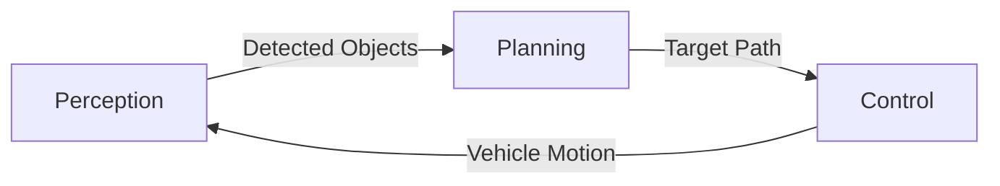

# Self-Driving Car Simulation

 *(Replace with actual animation GIF)*

A real-time simulation demonstrating core autonomous vehicle concepts including perception, path planning, and control systems. The simulator visualizes how a self-driving car navigates through dynamic environments with obstacles and traffic signals.

## Key Features

- **Multi-lane Road System** with configurable lane count and width
- **Dynamic Obstacle Avoidance** using object detection and path replanning
- **Traffic Light System** with state transitions (green/yellow/red)
- **Path Planning Algorithm** that adapts to road conditions
- **PID-like Controller** for steering and speed regulation
- **Sensor Simulation** with limited detection range
- **Real-time Visualization** using Matplotlib

## Technical Components



1. **Perception System**
   - Obstacle detection within sensor range
   - Traffic light state recognition
   - Distance calculation to objects

2. **Planning System**
   - Reference path generation
   - Dynamic path modification for obstacle avoidance
   - Traffic light response logic (stop/slow down)

3. **Control System**
   - Lookahead point tracking
   - Steering angle calculation
   - Speed regulation with acceleration profiles

## 🛠️ Installation

### Prerequisites

Ensure you have Python 3.7+ and the required libraries:

```bash
pip install matplotlib numpy
```

---

## 🚀 Running the Simulator

To run the simulation:

```bash
python self_driving_sim.py
```

Make sure your file is named appropriately, or change the filename accordingly.

---

## 📁 Project Structure

```
self-driving-car-simulator/
├── self_driving_sim.py      # Main simulation code
├── README.md                # Project documentation
```

---


## Dependencies
- Python 3.7+
- NumPy
- Matplotlib

## Installation & Usage

```bash
git clone https://github.com/yourusername/self-driving-car-sim.git
cd self-driving-car-sim
pip install -r requirements.txt
python simulation.py
```


## Simulation Output

The animation shows:
1. Autonomous vehicle (blue rectangle)
2. Planned path (blue line)
3. Obstacles (red circles)
4. Traffic light (color-coded indicator)
5. Lane markings (dashed lines)
6. Dynamic speed display

## Contribution

Contributions are welcome! Please fork the repository and submit pull requests for:

