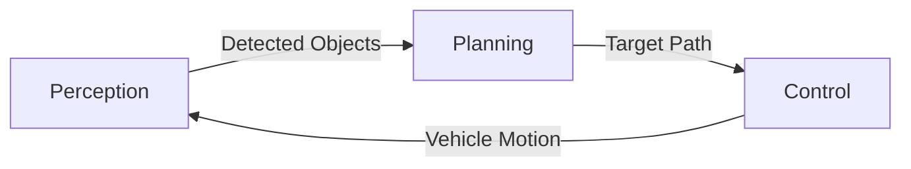

## Autonomous Car Driving :


## Technical Components



1. **Perception System**
   - Obstacle detection within sensor range
   - Traffic light state recognition
   - Distance calculation to objects

2. **Planning System**
   - Reference path generation
   - Dynamic path modification for obstacle avoidance
   - Traffic light response logic (stop/slow down)

3. **Control System**
   - Lookahead point tracking
   - Steering angle calculation
   - Speed regulation with acceleration profiles

## 🛠️ Installation

### Prerequisites

Ensure you have Python 3.7+ and the required libraries:

```bash
pip install matplotlib numpy
```

---

## 🚀 Running the Simulator

To run the simulation:

```bash
python Car.py
```

Make sure your file is named appropriately, or change the filename accordingly.

---

## 📁 Project Structure

```
self-driving-car-simulator/
├── Car.py      # Main simulation code
├── README.md                # Project documentation
```

---


## Dependencies
- Python 3.7+
- NumPy
- Matplotlib

## Installation & Usage

```bash
git clone https://github.com/yourusername/Car.git
cd Car
pip install -r requirements.txt
python simulation.py
```


## Simulation Output

The animation shows:
1. Autonomous vehicle (blue rectangle)
2. Planned path (blue line)
3. Obstacles (red circles)
4. Traffic light (color-coded indicator)
5. Lane markings (dashed lines)
6. Dynamic speed display

## Contribution

Contributions are welcome! Please fork the repository 

